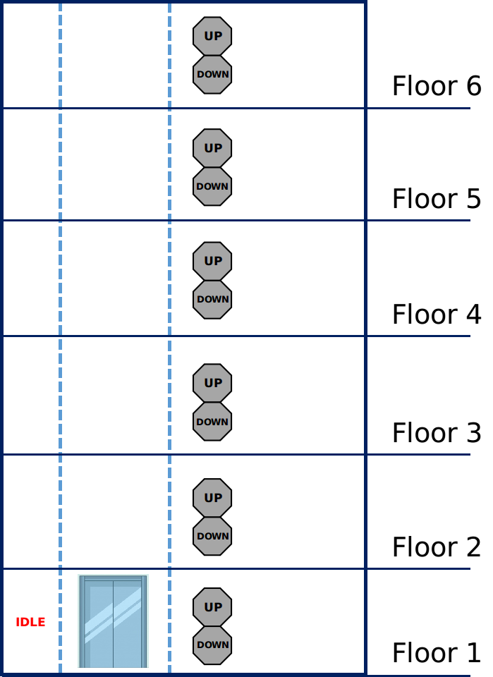
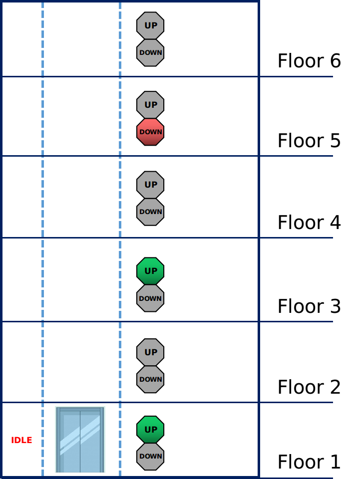
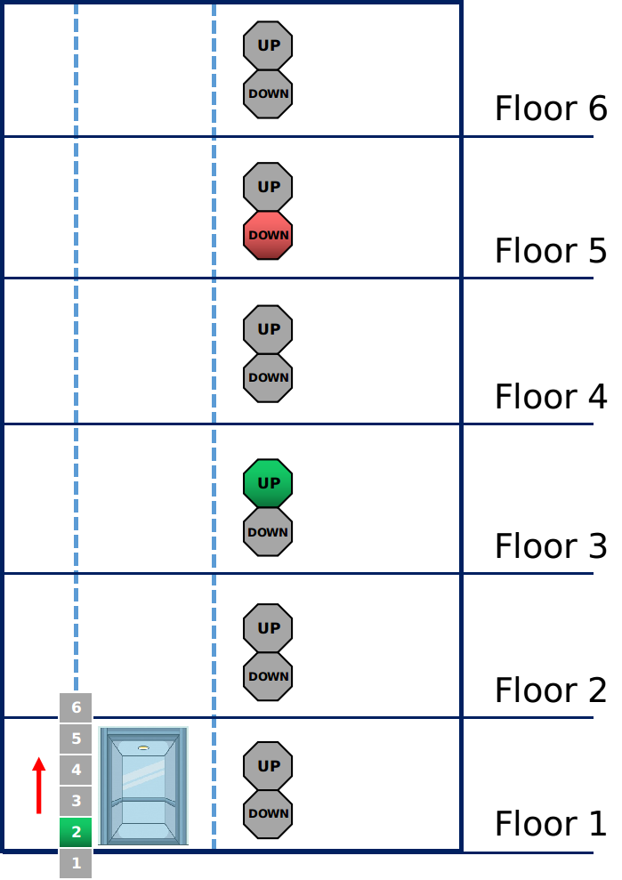
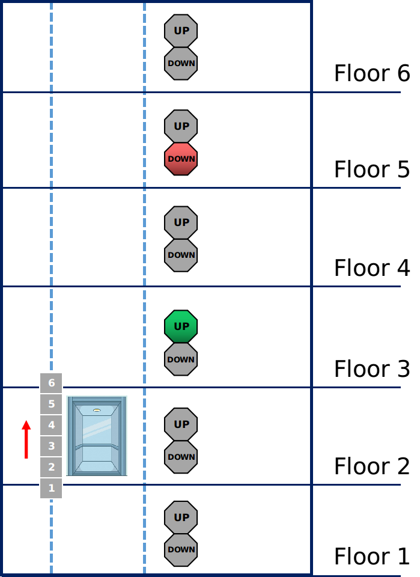
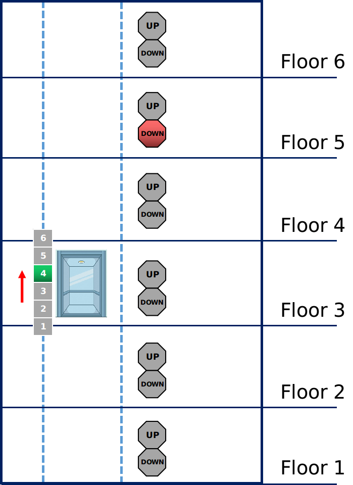
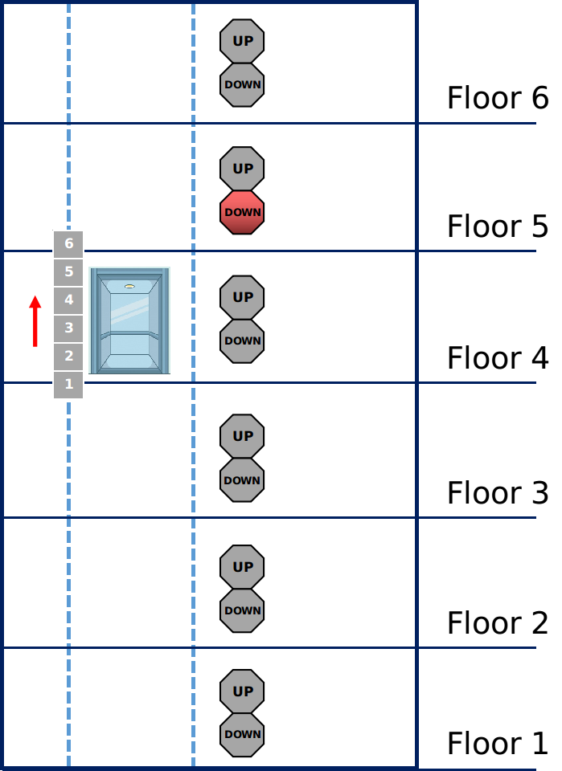
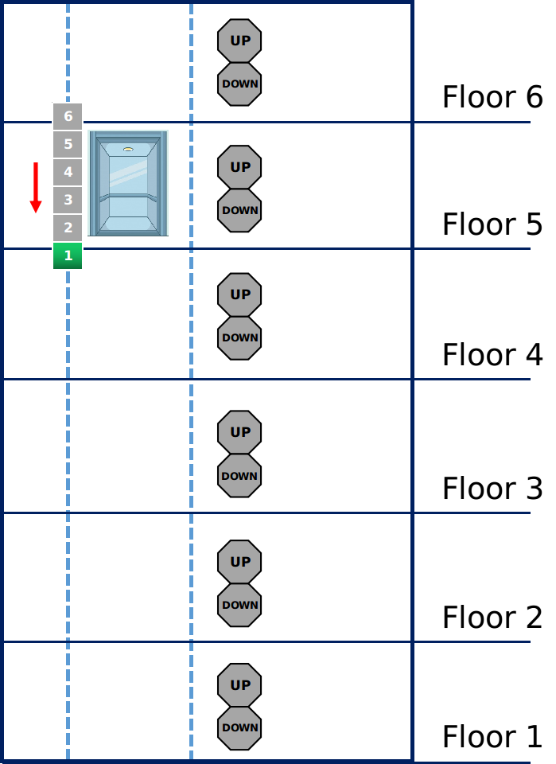
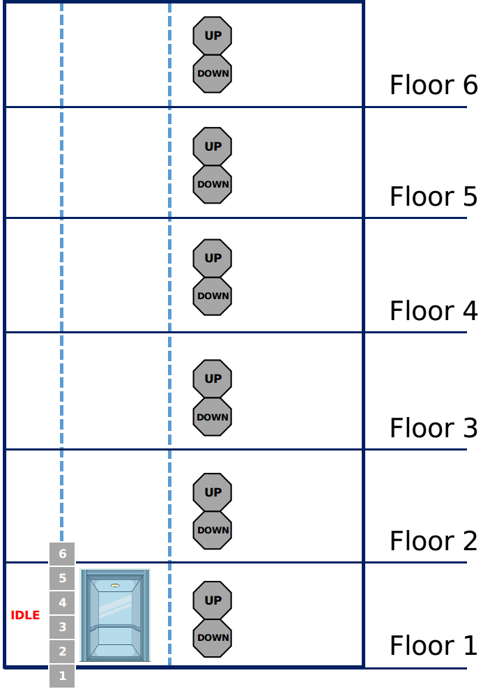

# Elevator System
This is a repo for the Capstone project in Udacity C++ Nanodegree Program.
The Capstone chosen here gives a chance to practice the knowledge of C++ programming language, by implementing the well-know Object-Oreiented Design (OOD) problem, Elevator System Design.

## Dependencies for Running Locally
* cmake >= 3.7
* make >= 4.1 (Linux, Mac), 3.81 (Windows)
* gcc/g++ >= 5.4

## Instructions for Building the Project
* Clone this repo.
* Make a build directory in the top level directory by: `mkdir build && cd build`.
* Compile by: `cmake .. && make`.

## Instructions for Running the Project
* Step 0: after finish the build process, run the executable by
    * `./elev_sys_sim`.
* Step 1: initialize an elevator system with N floors
    * the terminal would ask `Please set elevator system with N floors/levels, where N should a positive integer:`
    * simply type in a positive interger, for example, `6`, then hit `Enter`
    * if everything works fine, the terminal would inform the initialization works successfully, and shows some information about the current status of the elevator system
    * at this moment, the elevator system should look like this:  
    
* Step 2: set up external requests (i.e., push *Up* or *Down* buttons on multiple floors) to trigger the elevator
    * the terminal would ask `Please give an input: at how many floors the external elevator button is pushed (from 1 to N)`, where `N` is set in the step 1, in this example, `N` is `6` (the intuition here is to simulate that: in how many floors, people have pushed the **external elevator buttons**, i.e., *Up* or *Down*)
        * for example, we type in `3` then hit `Enter`
    * now, based on what the user has typed in, the terminal would ask multiple times about: `Please give an input: at which floor the external elevator button is pushed (from 1 to 6)` and `Which button you would press, Up or Down (u/d)? `
        * at this example, we type the information in turn: `1` + `u`, `3` + `u`, following by `5` + `d`
    * if everything works fine, the terminal would inform the external requests have been set up, and will start to execute them
    * at this moment, the elevator system should look like this:  
    
* Step 3: execute external requests, together with set up & execte internal requests (i.e., push *Floor #* buttons inside the elevator)
    * in our example, the elevator firstly execute the external request at floor #1, by opening the elevator gate and ask the user to set up an internal request (i.e.,  push *Floor #* buttons inside the elevator), here let's push `2` as we would like to take the elevator from floor #1 to floor #2
        * at this moment, the elevator system should look like this:  
        
    * next, the elevator would execute the internal request by landing at floor #2 then opening the gate, now let's push `-1` which means the internal execution is done and the customer would just go outside the elevator
        * at this moment, the elevator system should look like this:  
         
    * afterwards, the elevator would execute another external request by moving to floor #3, similarly, it would open the gate and ask the user to set up an internal request, here let's push `4` as we would like to take the elevator from floor #3 to floor #4
        * at this moment, the elevator system should look like this:  
         
    * next, the elevator would execute the internal request by landing at floor #4 then opening the gate, now let's push `-1` which means the internal execution is done and the customer would just go outside the elevator
        * at this moment, the elevator system should look like this:  
        
    * afterwards, the elevator would execute another external request by moving to floor #5, note that this time **the direction of request changed from upwards to downwards**, it would still open the gate and ask the user to set up an internal request, here let's push `1` as we would like to take the elevator from floor #5 to floor #1
        * at this moment, the elevator system should look like this:  
        
    * finally, the elevator would execute the internal request by landing at floor #1 then opening the gate, now let's push `-1` which means the internal execution is done and the customer would just go outside the elevator, note that at this moment, ALL the external & internal requests have been executed, the elevator would change its status to ***IDLE***
        * at this moment, the elevator system should look like this:  
        
* Step 4 (optional): till now the main function is pretty much done, while the simulation is set up to ***infinitely loop*** the external requests, as a result, it would go over *Step 1* to *Step 3* endlessly.
    * it is welcome for user to try his or her own example thru *Step 1* to *Step 3*, but keep in mind that this program is in a very early stage version, a ton of bugs are expected to happen
    * or user can just `Ctrl` + `C` to kill the program and exit

## Overview of Code Structure
First of all, the project is implemented via OOD (Object Oriented Design), with a major class `Elevator`, and several auxiliary classes, such as `ExternalRequest` & `InternalRequest` (both of them inherite `Request`), all of which are contained in `elevator.h/.cpp` and `request.h/.cpp`. Besides that, a simulation logic is implemented in 
`elevator_sim.cpp`. Here I'll just simply describe several important methods implemented within the class `Elevator`.
* `void Elevator::handleExternalRequest(ExternalRequest r)`
    * takes an `ExternalRequest` object as input, and arranges `up_stops_` or `down_stops_` as reference for next steps of elevator executing external requests
    * it would also change the elevator's status from *Up* to *Down* or vice versa
* `void Elevator::handleInternalRequest(InternalRequest r)`
    * takes an `InternalRequest` object as input, and similar to the External one, it also arranges `up_stops_` or `down_stops_` as reference for next steps of elevator executing internal requests
    * it would be available for a specific range a floors, but not for every floor
    * this methods doesn't change status of the elevator
* `void Elevator::openGate()`
    * this is the major method to process next `ExternalRequest` or `InternalRequest` by checking the information of `up_stops_` or `down_stops_` and current state of the elevator, `state_`
    * after the process is done, it would change the information of `up_stops_` or `down_stops_`
* `void Elevator::closeGate()`
    * this is the major method to modify the elevator's status, `status_`
* other than the methods above, there're several other auxiliary functions, such as printing out information, or setters/getters, please check the source files.

## Information about Rubric & Criteria
* Loops, Functions, I/O
    * The project demonstrates an understanding of C++ functions and control sturctures.
    * The project accepts user input and processes the input.
* Object Oriented Programming
    * The project uses Object Oriented Programming techniques.
    * Classes use appropriate access specifiers for class members.
    * Class constructors utilize member initialization lists.
    * Classes abstract implementation details from their interfaces.
    * Classes encapsulate behavior.
* Memory Management
    * The project makes use of references in function declarations.
    * The project uses scope / Resource Acquisition Is Initialization (RAII) where appropriate.
* Concurrency
    * (Right now, no Concurrency stategy has been adopted)